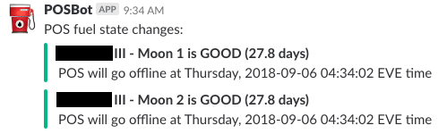

# EVE POSBot

This Ruby application can be used to notify Slack channels of the _fuelling
state_ of a corporation's POS (Player Owned Starbase) structures. A structure's
fuelling state is one of the following:

* `unknown`
* `good`
* `warning`
* `danger`

The application remembers the previous state of each structure so that it can
be run often but only report when a structure's state changes.

Note: POSBot is a simple variant of my FuelBot application, which performs the
same monitoring for the more modern Upwell structures. Because POSes are in
the process of being gradually removed from EVE, and because the mechanics are
somewhat different, I decided it was simpler to build a separate application
just for the legacy structure type rather than trying to integrate them.

## Configuration

The application takes its configuration from a file named on the command line,
or `config.yaml` by default. This file contains
various secrets, so I haven't included the one I'm using in the repository.
Instead, `example-config.yaml` can be used as a template.

### SSO and ESI Configuration

You need to have registered a third-party application with CCP
at <https://developers.eveonline.com>; this will give
you the `client_id` and `client_secret` values to put in the configuration.
Your application's registration should include at least the following scope:

* `esi-corporations.read_starbases.v1`

Once you have a registered application, you need to manually use the EVE SSO
to log in as a character from the target corporation with the "Director"
role, and request those same scopes. If you don't know how to do this, CCP
have [a step-by-step article](https://developers.eveonline.com/blog/article/sso-to-authenticated-calls)
covering the process.

The resulting refresh token goes into the
`refresh_token` configuration item.

### Operational Configuration

If present, the `systems` configuration item is a list of solar system names;
the application will only report on structures anchored in these systems.
If `systems` is absent, structures in all systems will be included.

The configuration items `danger_days` (default 3) and `warning_days` (default
7) determine how to translate the time left before fuel runs out into
a fuelling state:

* If the time left is less than or equal to `danger_days`, the state will
  be `danger`.

* If the time left is greater than `danger_days` but less than or equal to
  `warning_days`, the state will be `warning`.

* If the time left is greater than `warning_days`, the state will be `good`.

If you don't want to use the `warning` state, just set `danger_days` and
`warning_days` to the same value. Structures will then go straight from
`good` to `danger`.

The application tracks the previous fuelling state of structures so that it can
notify the Slack channel only when the state changes. This state is held by
default in the file `state.yaml`, but if you'd like to put the state file
somewhere else (for example so that you can mount it into a Docker container)
then its location is taken from the `statefile` configuration item.

If any of the notifications are for a `danger` state,
the message will be an `@channel` ping.

### Slack Configuration

If there are some state changes to notify (within the given solar systems) then
Slack's "incoming webhooks" facility is used to make a nice notification with an
attachment state change. The details are nested under a `slack` configuration
item:

* The URL you get from your webhook configuration goes in `webhook_url`

* `channel` can be a public or private channel prefixed by `#`, e.g.,
  `'#fuel-panics'`. It can also be a user name prefixed by `@`.

## Setup and Execution

Set up as follows:

```bash
$ bundle install --path vendor
```

Execute like this:

```bash
$ bundle exec ruby fuelbot.rb
```

Over in Slack, you might see something like this:



## Using Docker for Deployment

The application is designed to be relatively friendly to being deployed
as a Docker image and executed within a container. The following files
are included to give some ideas as to how to go about that:

* `.dockerignore`
* `docker-build`
* `docker-run`
* `Dockerfile`

The assumption is that you have a basic level of understanding about how
Docker works; let me know in a GitHub issue if you have that but something
is still unclear.
